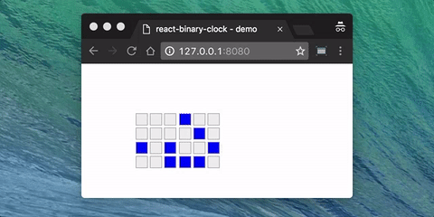

# react-binary-clock

A binary clock is a clock that displays the time of day in a binary format.

> Sometimes, the elegant implementation is just a function.
>
> Not a method.
>
> Not a class.
>
> Not a framework.
>
> Just a function. 
>
> _John Carmack_

## Usage

Install via npm using the following npm command:

```bash
npm i -S react-binary-clock
```

Include and use the component within your React application:

```javascript
import BinaryClock from 'react-binary-clock';

// example
render(
  <div>
    <BinaryClock />
  </div>,
  document.getElementById('app')
);
```

> N.B.: This component is completely **style-less** which means that you need to add your own CSS to your React app 
in order to see the binary clock in action; if you need an example you can have a look at the [CSS include in the demo app](demo/style.css)

## Demo

Clone or download this GitHub repository then run a live demo using the following npm commands:

```bash
npm i
npm start
```

You should be able to see something like this into your terminal:

```bash
Starting up http-server, serving ./
Available on:
  http://127.0.0.1:8080
  http://192.168.0.12:8080
```


